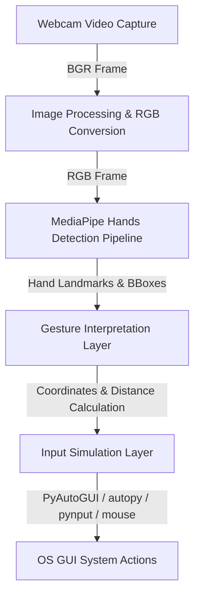

# Gesture Mouse System Architecture

This document details the system design, data flow, and interactions between the components of the Gesture Interaction Virtual Mouse.

## High-Level System Overview
The system follows a modular architectural pattern consisting of three core layers:
1. Perception Layer (Webcam Capture via OpenCV)
2. Processing & Tracking Layer (MediaPipe Hands pipeline)
3. Input Simulation Layer (autopy, pyautogui, pynput, and mouse)

## Processing Pipeline Flow

